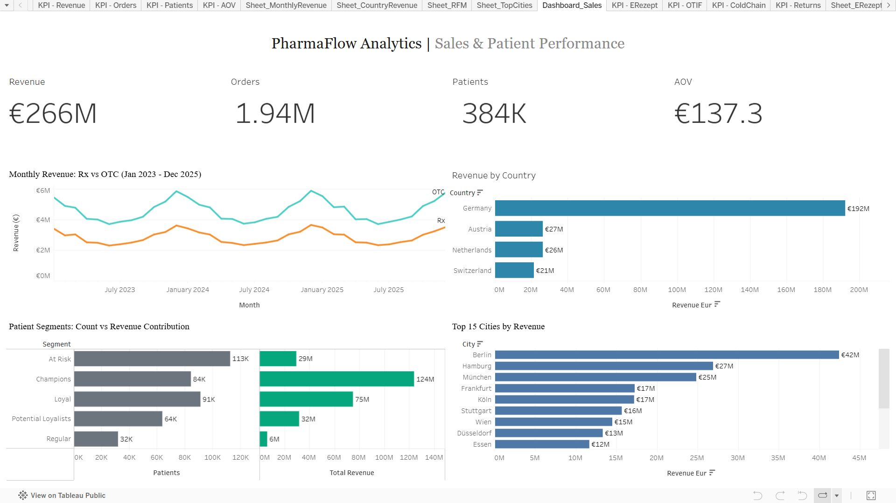
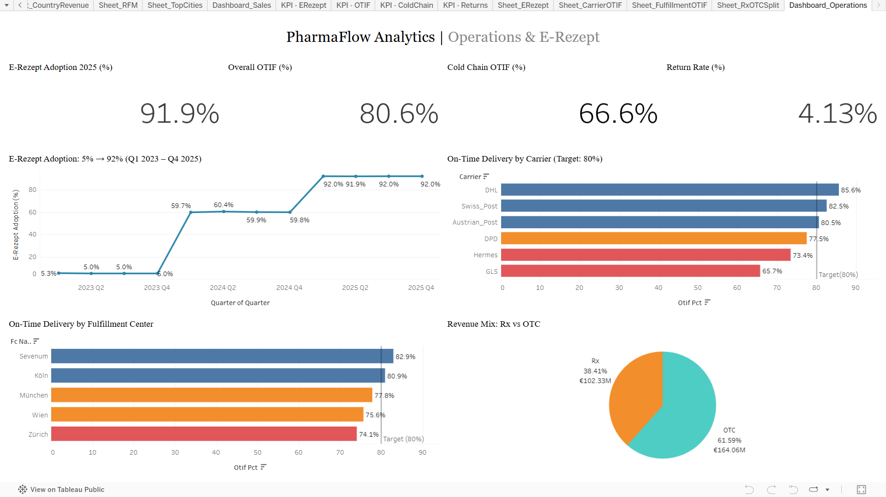

# 💊 PharmaFlow Analytics - Online Pharmacy Operations & Patient Insights for the DACH Market

> **End-to-end analytics on a 10.8-million-row synthetic dataset modeling a Redcare / Shop Apotheke-style online pharmacy operating across Germany, Austria, Switzerland, and the Netherlands.**

    

---

## 🎯 Project Summary

PharmaFlow Analytics is a portfolio project simulating a full-stack analyst workflow for an online pharmacy operating across the DACH region. Using a synthetic dataset of **10.8M rows across 9 relational tables**, the project covers the end-to-end workflow: data generation -> SQL analysis -> Python statistical analysis -> business insights -> interactive Tableau dashboards.

The analysis is framed around the operational and commercial questions a real pharmacy analyst would face like patient lifetime value, prescription processing efficiency, cold-chain delivery performance, carrier reliability, and the **E-Rezept (electronic prescription) adoption story** that is reshaping German pharmacy in 2024-2026.

---

## 📊 Headline KPIs

| KPI | Value | Why It Matters |
|---|---|---|
| Total Revenue (3-year) | **€266.4M** | GMV across delivered orders Jan 2023 - Dec 2025 |
| Total Orders | **1,939,990** | Excludes cancellations |
| Active Patients | **384,394** | Patients with ≥1 delivered order |
| Average Order Value | **€137.32** | Strong vs pharma benchmarks |
| Rx Revenue Share | **38.4%** | Prescription orders driving stable revenue |
| **E-Rezept Adoption (2025)** | **91.9%** | Up from 5.0% in 2023 |
| Overall On-Time Delivery | **80.6%** | Above 80% industry target |
| Cold-Chain On-Time | **66.6%** | 14-point gap = identified operational risk |
| Return Rate | **4.13%** | Well below e-commerce benchmark |

---

## 🌐 Live Tableau Dashboards

| Dashboard | What It Shows | Link |
|---|---|---|
| **Sales & Patient Performance** | Revenue, AOV, patient segments (RFM), geography | [View on Tableau Public](https://public.tableau.com/views/PharmaFlowAnalytics/Dashboard_Sales) |
| **Operations & E-Rezept** | OTIF, carrier performance, fulfillment centers, prescription mix | [View on Tableau Public](https://public.tableau.com/views/PharmaFlowAnalytics/Dashboard_Operations) |

### 📸 Dashboard 1 - Sales & Patient Performance


### 📸 Dashboard 2 - Operations & E-Rezept


---

## 🔍 8 Key Findings

> Full analytical writeup: **[BUSINESS_INSIGHTS.md](BUSINESS_INSIGHTS.md)**

| # | Finding | Key Number |
|---|---|---|
| 1 | E-Rezept adoption exploded 18x in 24 months | 5% -> 92% |
| 2 | E-Rezept cuts prescription processing time by 71% | 14h -> 4h |
| 3 | Top 20% of patients drive 47% of revenue | €124.4M from 76K patients |
| 4 | Chronic patients are 3x more valuable than acute | €1,249 vs €416 LTV |
| 5 | GLS underperforms DHL by 20 percentage points | 85.6% vs 65.7% OTIF |
| 6 | Cold-chain shipments run 14 points below standard | 66.6% vs 80.6% OTIF |
| 7 | Medical Devices: #1 revenue + #1 returns | €73.1M revenue / 9.3% return rate |
| 8 | DE = 72.1% of revenue; AT, NL, CH are growth markets | Berlin alone = €42M |

---

## 🛠️ Tech Stack

| Layer | Tools |
|---|---|
| **Data generation** | Python, NumPy, Pandas, Faker (Python-generated synthetic data) |
| **SQL analysis** | DuckDB (in-memory analytical database, 18 business queries) |
| **Statistical analysis** | Python, pandas, scipy (t-tests), matplotlib, seaborn |
| **Customer analytics** | RFM segmentation, LTV cohort analysis |
| **Visualization** | Tableau Public (2 dashboards, 19+ visualizations) |
| **Version control** | Git + GitHub |

---

## 📁 Repository Structure

```
pharmaflow-analytics/
├── README.md                        <- You are here
├── BUSINESS_INSIGHTS.md             <- Full 8-finding analytical writeup
│
├── 01_data_generation/
│   ├── PharmaFlow_01_DataGeneration.ipynb
│   └── README.md
│
├── 02_sql_analysis/
│   ├── PharmaFlow_02_SQL_Analysis.ipynb
│   ├── queries/                     <- 18 individual .sql files
│   └── README.md
│
├── 03_python_analysis/
│   ├── PharmaFlow_03_Python_Analysis.ipynb
│   ├── charts/                      <- Saved PNGs from analysis
│   └── README.md
│
├── 05_tableau/
│   ├── dashboard_sales.png
│   ├── dashboard_operations.png
│   └── README.md
│
└── data/
    ├── master_table_sample.csv      <- 50K-row sample for preview
    └── README.md                    <- Data dictionary
```

---

## 🚀 How to Reproduce This Project

1. **Generate the data** - Open `01_data_generation/PharmaFlow_01_DataGeneration.ipynb` in Google Colab. Run all cells. Output: 9 CSV files (~450 MB total).
2. **Run SQL analysis** - Open `02_sql_analysis/PharmaFlow_02_SQL_Analysis.ipynb`. Run all 18 queries against the generated data in DuckDB.
3. **Run Python analysis** - Open `03_python_analysis/PharmaFlow_03_Python_Analysis.ipynb`. Generates charts + Tableau-ready aggregated CSVs.
4. **View dashboards** - Open the [Tableau Public links above](#-live-tableau-dashboards).

> Total runtime: ~20 minutes on Google Colab CPU runtime.

---

## 💡 What This Project Shows

- **End-to-end analyst workflow** - data engineering -> SQL -> Python -> Tableau, with each layer documented
- **Domain understanding** - DACH pharmacy regulations (E-Rezept), cold-chain logistics, Rx vs OTC operations
- **Statistical rigor** - t-tests for significance, RFM segmentation, LTV cohort analysis
- **Business framing** - every finding includes a recommendation, not just a number
- **Production discipline** - version control, reproducible notebooks, data dictionary, modular SQL files

---

## ⚠️ Disclaimer

This project uses **synthetic data generated with Python**. It is modeled on real online-pharmacy business operations (Redcare, Shop Apotheke, DocMorris) but does not contain real patient, prescription, or company data. Numbers are illustrative; the workflow follows real industry practice.

---

## 👤 Author

**Pavan Raj Kotagiri** - Aspiring Data / Business / Supply Chain Analyst (Germany)

- 💼 [LinkedIn](https://linkedin.com/in/pavanrajkotagiri)
- 🌐 [Tableau Public Profile](https://public.tableau.com/app/profile/pavan.raj.kotagiri)
- 💻 [GitHub](https://github.com/pavan-function)

---

*If this project resonates with your team's work, I'd love to connect.*
